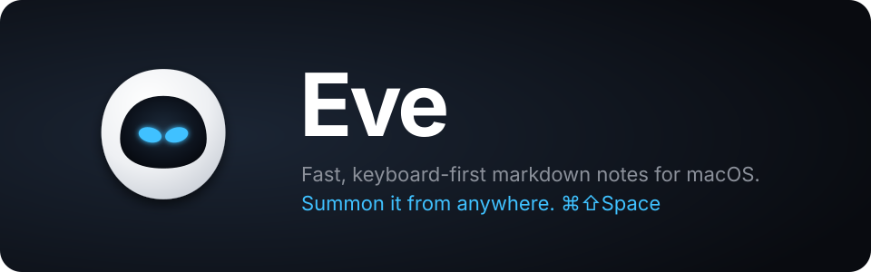

<p align="center"></p>

# Eve

Named after EVE from Pixar's *WALL·E* ([wiki](https://en.wikipedia.org/wiki/WALL-E)): a sleek white shell,
a black visor, and glowing blue eyes. The theme borrows exactly those four colors — shell white, soft gray,
visor black, eye blue — with the blue reserved for what matters: links, focus, and the cursor of attention.

Fast, keyboard-first markdown notes for macOS. Summon it from anywhere with a global hotkey,
type Notion-style markdown, link notes with `[[wiki links]]`, and sync through your own server.

- **Instant** — Tauri 2 shell (native WKWebView, ~10 MB), Svelte 5 UI, TipTap editor. No Electron.
- **Global hotkey** — `⌘⇧Space` (default) shows/hides Eve over any app; focus returns to where you were.
- **Live markdown** — `# `, `- `, `1. `, `[ ] `, `> `, ` ``` `, `**bold**`, `` `code` ``… render as you type.
- **Every shortcut is rebindable** live in Settings (`⌘,`): system hotkey, app actions, editor formatting.
- **Notes link to notes** — type `[[` for a picker; click a link to jump (creates the note if missing). `⌘[` / `⌘]` go back and forward through the notes you visited, restoring the cursor.
- **`/` block menu** — callouts (`> [!💡]` in markdown), code blocks, dividers, images (copied into `notes/assets/`), note links. Headings and lists come from markdown shortcuts (`# `, `- `, `1. `, `[ ] `, `> `).
- **Sidebar** with search (`⌘K`), collapsible **groups** (folders, nested up to 3 levels). Drag notes or whole groups to reorder or move them; `⌘\` opens and focuses the list (press again from the list to close it and return to the editor) (↑↓ move, ⌥↑↓ reorder notes or groups, ⌥← ⌥→ un-nest / nest a group, Space or ← → fold, ⌫ deletes with confirmation, Esc back).
- **Opens .md files** — Eve registers as a Markdown editor, so it shows up in Finder's *Open With*. Such files are edited in place and listed under *Open files* (not synced; ⌫ closes them).
- **Plain files** — each note is a `.md` with a tiny frontmatter (id, updated, group) in `~/Library/Application Support/dev.happynut.eve/notes/`.
- **Self-hosted sync** — a zero-dependency Node server (`server/`), one Docker command, last-writer-wins.

## Run

```bash
npm install
npm run app        # tauri dev (needs Rust: https://rustup.rs)
npm run bundle     # builds src-tauri/target/release/bundle/macos/Eve.app (~4 MB); drag it to /Applications
```

`npm run dev` runs the UI alone in a browser (notes go to localStorage) — handy for UI work.

## Default shortcuts

| Scope  | Action                          | Keys              |
| ------ | ------------------------------- | ----------------- |
| system | Summon / dismiss Eve            | `⌘⇧Space`         |
| app    | New note / New group / Search   | `⌘N` `⌘⇧N` `⌘K`   |
| app    | Next / previous note / Back / Forward | `⌘⇧↓` `⌘⇧↑` `⌘[` `⌘]` |
| app    | Sidebar: open + focus / close   | `⌘\`              |
| app    | Delete note / Settings / Hide   | `⌘⇧⌫` `⌘,` `Esc`  |
| editor | Bold / Italic / Underline       | `⌘B` `⌘I` `⌘U`    |
| editor | Strike / Code / Link / `[[`     | `⌘⇧X` `⌘E` `⌘⇧K` `⌘⇧L` |
| editor | `/` menu / Callout / Image       | `⌘/` `⌘⇧C` `⌘⇧I` |
| editor | Text / H1 … H5                  | `⌘⌥0` `⌘⌥1` … `⌘⌥5` |
| editor | Bullets / Numbers / To-dos      | `⌘⇧8` `⌘⇧7` `⌘⇧9` |
| editor | Quote / Code block / Divider    | `⌘⇧.` `⌘⌥C` `⌘⇧-` |

Change any of them in Settings → Shortcuts: click the key chip, press the new combo. Applies immediately; a combo already used by another action is refused and the conflict is named.

## Sync server

```bash
cd server
EVE_TOKEN=$(openssl rand -hex 24) docker compose up -d      # or: EVE_TOKEN=... node index.mjs
```

Then in Eve → Settings → Sync, enter the URL (e.g. `https://notes.example.com`) and the token.
Sync runs 2 s after edits, every minute, and on focus. Images in `notes/assets/` are not synced (yet). Put it behind HTTPS (Caddy, Tailscale, …).

Protocol is one endpoint: `POST /sync {cursor, notes[]} → {cursor, notes[]}`. Conflicts resolve
last-writer-wins by `updatedAt`; deletes are tombstones. `node server/test.mjs` exercises it.

## Layout

```
src/                Svelte UI
  lib/notes.svelte.ts     note store, .md (de)serialization
  lib/shortcuts.svelte.ts all key bindings + rebinding logic
  lib/editor.ts           TipTap setup, live keymap
  lib/wikilink.ts         [[link]] node + markdown rule + suggestion popup
  lib/sync.svelte.ts      sync client
src-tauri/          Rust: file storage commands, window toggle, global-shortcut plugin
server/             sync server (Node ≥ 22, node:sqlite), Dockerfile, compose.yaml
```

MIT.
