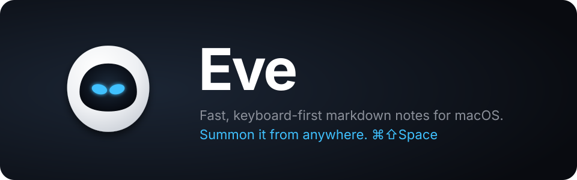

<p align="center"></p>

# Eve

Named after EVE from Pixar's *WALL·E* ([wiki](https://en.wikipedia.org/wiki/WALL-E)): a sleek white shell,
a black visor, and glowing blue eyes. The theme borrows exactly those four colors — shell white, soft gray,
visor black, eye blue — with the blue reserved for what matters: links, focus, and the cursor of attention.

Fast, keyboard-first markdown notes for macOS. Summon it from anywhere with a global hotkey,
type Notion-style markdown, link notes with `[[wiki links]]`, and sync through a private GitHub repo.

- **Instant** — Tauri 2 shell (native WKWebView, ~10 MB), Svelte 5 UI, TipTap editor. No Electron.
- **Global hotkey** — `⌘⇧Space` (default) shows/hides Eve over any app; focus returns to where you were. Like Raycast, Eve stays out of the Dock and ⌘Tab (toggle in Settings → Sync & app). Eve launches at login (toggle in Settings); closing the window only hides it, so the hotkey keeps working. `⌘Q` quits.
- **Live markdown** — `# `, `- `, `1. `, `[ ] `, `> `, ` ``` `, `**bold**`, `` `code` ``… render as you type.
- **Every shortcut is rebindable** live in Settings (`⌘,`): system hotkey, app actions, editor formatting.
- **Notes link to notes** — type `[[` for a picker; click a link to jump (creates the note if missing). `[[Note|shown as]]` links under another name, as in Obsidian. `⌘[` / `⌘]` go back and forward through the notes you visited, restoring the cursor.
- **Link cards** — paste a URL on an empty line (or type one and press Enter) and it becomes a compact preview card: favicon, title, description, thumbnail; click opens the browser. The file keeps just the bare URL.
- **Find & replace in a note** — `⌘F` (or the note's right-click menu; on a phone, the note's ⋯) opens a bar over the note: ↩ / ⇧↩ walk the matches, the replace field replaces one at a time (↩) or all at once.
- **Section outline** instead of a scrollbar — when a note is taller than the window, one tick per heading sits at the left edge, dark for the sections on screen; hover to see the titles, click to jump.
- **Obsidian's syntax** — `[[Note|alias]]` links, `==highlights==` (`⌘⇧H`), and callouts by type: `> [!warning] Title` shows the type's icon and colour, the text on its line as the title; the fold mark (`-`/`+`) is kept. A vault's notes read and save back unchanged.
- **`/` block menu** — callouts (`> [!💡]` in markdown), code blocks, dividers, images (copied into `notes/assets/`), note links, kanban boards. Headings and lists come from markdown shortcuts (`# `, `- `, `1. `, `[ ] `, `> `).
- **Kanban** — `/kanban` drops a Notion-style board into the note. Drag cards between columns, or drive it from the keyboard: ↑↓←→ move between cards, ⌥↑↓←→ move a card (⌥←→ a column), Enter opens the card as a floating page with its own markdown body, ⌫ deletes. ↓ from the line above (↑ from the line below) steps into the board; Esc steps back out. The + past the last column adds one; hovering the board shows a × under it that deletes the board (or press ⌫ at the start of the line after it). The file keeps a ```` ```kanban ```` fence holding JSON (`{ "columns": [{ "title", "cards": [{ "title", "body" }] }] }`); a fence that fails to parse is shown as a plain code block, so a bad edit never loses cards.
- **Sidebar** with search (`⌘K`; ↓ walks into the matches, ↑ from the first comes back), emoji icons for notes and groups (picker above the title, like Notion), hold `⌘` to number the visible notes and `⌘1`…`⌘9` to jump, collapsible **groups** (folders, nested up to 3 levels). Drag notes or whole groups to reorder or move them; `⌘\` opens and focuses the list (press again from the list to close it and return to the editor) (↑↓ move, `i` sets an emoji icon, ⌥↑↓ move notes or groups one row at a time (groups walk out of and into other groups), ⌥← ⌥→ un-nest / nest a group, Space or ← → fold, → on a note or an open group (or Esc) back to the editor, ⌫ deletes with confirmation). The list stays open while you write; Settings → Appearance → *Close sidebar when you start writing* folds it away at the first keystroke instead.
- **Opens .md files** — Eve registers as a Markdown editor, so it shows up in Finder's *Open With*. Such files are edited in place and listed under *Open files* (not synced; ⌫ closes them).
- **Plain files** — each note is a `.md` with a tiny frontmatter (id, updated, group) in `~/Library/Application Support/dev.happynut.eve/notes/`.
- **Sync without a server** — a private GitHub repository is the backend: one commit per change, last-writer-wins, images included. Edit a note on github.com and it comes back to the app.
- **Claude reads your notes** — Settings → Claude → Connect registers Eve's MCP server with Claude Desktop and Claude Code in one click; Claude can then list, search and read your notes, and open one in Eve for you, never change them (see [Claude (MCP)](#claude-mcp)). The same commands work in a terminal: `eve help` (see [Command line](#command-line)).

## Install

```bash
brew install --cask happy-nut/tap/eve
```

Apple silicon only. The app is ad-hoc signed, not notarized; the cask strips the quarantine flag so it opens
without a Gatekeeper detour. New versions arrive in the app, as on the phone: when one is out, the sidebar and
Settings → Version offer **Update**, which downloads the release's zip, checks it against the SHA-256 GitHub lists
for it, puts the new Eve.app in place of the old one and restarts (`brew reinstall --cask happy-nut/tap/eve` does the same by hand;
0.7.12 and older need it once).
Releases are built by `.github/workflows/release.yml` from a `v*` tag; the cask lives in [happy-nut/homebrew-tap](https://github.com/happy-nut/homebrew-tap).

## Run from source

```bash
npm install
npm run app        # tauri dev (needs Rust: https://rustup.rs)
npm run bundle     # builds src-tauri/target/release/bundle/macos/Eve.app (~4 MB); drag it to /Applications
```

`npm run dev` runs the UI alone in a browser (notes go to localStorage) — handy for UI work.

## Android

The same app runs on Android (Tauri's Android target), syncing through the same `eve-notes` repository.
Sign in from Settings → Sync on the phone too.

- **Home-screen widget** — long-press the home screen → Widgets → Eve. It asks what to show: the newest notes,
  or one note pinned and shown whole. Markdown is drawn as in the editor (to-dos, bold, code, links,
  callouts, boards as a column count). Tap a note to open it ready to write, + for a new one, ↻ to sync now;
  long-press → the pencil changes what it shows.
- **Background sync** — every 15 minutes (Android's floor) while Eve is closed, notes changed elsewhere come
  down and the widget redraws. The app pushes when it leaves the screen.
- Back goes from a note to the list, and from the list out of the app.

```bash
npm run tauri -- android dev              # on a connected phone or emulator (needs ANDROID_HOME, NDK_HOME)
npm run tauri -- android build --apk      # src-tauri/gen/android/app/build/outputs/apk/
```

The phone has its own version (`src-tauri/tauri.android.conf.json`) and its own releases: an `android-v*` tag
builds only the signed APK (never marked Latest, so Homebrew keeps pointing at the Mac), a `v*` tag only the Mac
app. Installed phones find newer APKs by themselves and update with one tap.

Not on the phone: the global hotkey, Dock/login-item settings, PDF/image export, and Quick Look previews.

## Default shortcuts

| Scope  | Action                          | Keys              |
| ------ | ------------------------------- | ----------------- |
| system | Summon / dismiss Eve            | `⌘⇧Space`         |
| app    | New (note / group menu) / Search | `⌘N` `⌘K`        |
| app    | Next / previous note / Back / Forward | `⌘⇧↓` `⌘⇧↑` `⌘[` `⌘]` |
| app    | Sidebar: open + focus / close   | `⌘\`              |
| app    | Delete note / Settings / Hide   | `⌘⇧⌫` `⌘,` `Esc`  |
| editor | Bold / Italic / Underline       | `⌘B` `⌘I` `⌘U`    |
| editor | Strike / Code / Link / `[[`     | `⌘⇧X` `⌘E` `⌘⇧K` `⌘⇧L` |
| editor | Highlight (`==`)                | `⌘⇧H`             |
| editor | `/` menu / Callout / Image       | `⌘/` `⌘⇧C` `⌘⇧I` |
| editor | Text / H1 … H5                  | `⌘⌥0` `⌘⌥1` … `⌘⌥5` |
| editor | Bullets / Numbers / To-dos      | `⌘⇧8` `⌘⇧7` `⌘⇧9` |
| editor | Quote / Code block / Divider    | `⌘⇧.` `⌘⌥C` `⌘⇧-` |

Settings → Appearance sets the theme (system, or pinned light / dark) and the editor typeface (system, serif, rounded, mono or any CSS font family), size, line height and text width.

Change any of them in Settings → Shortcuts: click the key chip, press the new combo. Applies immediately; a combo already used by another action is refused and the conflict is named.

## Sync

Settings → Sync → **Sign in with GitHub**. Eve shows an 8-character code, opens github.com/login/device in your
browser, and after you authorize it creates a private `eve-notes` repository under your account (or uses the
existing one) and starts syncing. Sync runs 2 s after edits, every minute, and on focus. Sign in on every device.

The repo mirrors the local folder: `notes/<id>.md` (frontmatter included) and `notes/assets/*`. Each round is
one `main` head lookup; changed files are fetched by blob and pushed as a single commit through the git data API
(no git binary). Conflicts resolve last-writer-wins by `updatedAt`; deletes are tombstones; a note untouched
locally since the last sync takes the remote version, so edits made on github.com win.

**GitHub Enterprise, an organization, or a token**: under the Sign in button, *GitHub Enterprise, an
organization, or a token…* takes a server (`acme.ghe.com` for Enterprise Cloud with data residency, or a
company's own GitHub Enterprise Server such as `github.acme.com`; blank for github.com, Enterprise Cloud
included), an owner (blank for your account, or an organization, where a company may want the notes kept),
and either a token (a classic one with the `repo` scope; *create one* opens that server's page for it) or,
for browser sign-in on another server, the Client ID of an OAuth App its admin registered for Eve with
Device Flow on. The repository must be private: an existing `internal` or public one is refused. The phone
set up from the Mac, and its background sync, use the same server. A server inside a company network needs
that network (VPN) on the phone too.

Sign-in is the OAuth device flow of the "Eve" OAuth App (`CLIENT_ID` in `src/lib/github.ts`; running your own
fork: register an OAuth App with *Device Flow* enabled and paste its client id). The two github.com calls go
through macOS's `curl` from Rust because github.com/login has no CORS. `npm test` runs the sync engine against an
in-memory fake; `EVE_TEST_REPO=owner/name EVE_TEST_TOKEN=… npm test` runs it against a real repo.

## Claude (MCP)

Settings → Sync & app → Claude → **Connect** lets Claude read your notes. One click registers Eve's
read-only [MCP](https://modelcontextprotocol.io) server with every Claude app on the Mac: it adds `eve` to
Claude Desktop's `claude_desktop_config.json` (every other key kept, in its order; the file as it was before is
saved once as `claude_desktop_config.json.eve-backup`), and runs
`claude mcp add --scope user eve -- …/Eve.app/Contents/MacOS/eve mcp` for Claude Code. Restart Claude Desktop
after connecting.

The server is the app's own binary started as `eve mcp` (no window, no Tauri): it reads `notes/*.md` from disk,
so it works while Eve is closed. It only hands over the notes, exactly as written; what to do with them is up to
Claude and you. Nothing it offers writes. Tools: `list_notes` and `search_notes` (every word must match; title
hits first) find notes, narrowed by group and by the dates a note was made or last changed (`from` / `to`:
`2026-09` or `2026-09-05`, local time); `read_note` returns one (by title or id, a `[[Title#Section]]` link, or
one section) and `read_notes` several, by id, in the order given. `open_note` shows one in Eve — the running
app comes to the front with that note open, at a section if one is named (Eve starts if it was not running):
"find last week's meeting notes and open them". It hands macOS an `eve://open?id=…&section=…` link, which Eve
registers; such a link only ever shows a note, an unknown id is ignored, and nothing is created or changed.
Being the one tool that is not read-only, Claude asks before its first use. A note's creation time comes from its id (a
day's note is its day); only its last change is known, so a note edited in September and again in October is
found under October. Deleted notes and the calendar's own are left out.

Every answer stays under ~9,000 tokens (Claude Code warns past 10,000 and sets anything past 25,000 aside in a
file). What does not fit continues in the next answer, never shortened: a note is cut between lines (a code block
cut open is closed off), the first part of a long note lists its sections, and the answer ends with a `cursor` to
pass back, refused if the note changed meanwhile. Long lists name how many were left out. A note file past 8 MB
is read that far; bytes that are not UTF-8 show as `�` rather than the note going missing; a title two notes
share names the other; a missing notes folder names the path it looked in. By hand, from any MCP client: command
`/Applications/Eve.app/Contents/MacOS/eve`, args `["mcp"]`; `EVE_NOTES_DIR` points it at another folder.

## Command line

Every tool is also a command, the same code with the same answers (`src-tauri/src/core.rs` holds them once;
the MCP server and the command line only translate):

```bash
eve help                       # the commands; eve help <command> for one in full
eve list --group Work --from 2026-09
eve search 회의 결정 --limit 5
eve read "Weekly plan" --section Goals
eve read-many <id> <id>        # several, whole, in order
eve open "Weekly plan"         # show it in the running Eve
```

Homebrew links `eve` onto the PATH (the cask's `binary`); otherwise it is `/Applications/Eve.app/Contents/MacOS/eve`.
Bare words go to the command's main argument (the query, the title, the ids); the rest are `--name value`. Long
answers end with a cursor, passed back as `--cursor`. `eve` with no command starts the app, as before.

## Layout

```
src/                Svelte UI
  lib/notes.svelte.ts     note store, .md (de)serialization
  lib/shortcuts.svelte.ts all key bindings + rebinding logic
  lib/editor.ts           TipTap setup, live keymap
  lib/wikilink.ts         [[link]] node + markdown rule + suggestion popup
  lib/sync.svelte.ts      sync client (notes + images <-> GitHub)
  lib/github.ts           GitHub REST sync engine (pure, tested in Node)
src-tauri/          Rust: file/asset storage commands, window toggle, global-shortcut plugin
  src/core.rs             the notes' commands (list, search, read, open) and their help, read from disk
  src/mcp.rs              `eve mcp`: those commands as an MCP server over stdio
  src/cli.rs              `eve <command>`: the same commands in a terminal
  src/mcp_setup.rs        Settings → Claude: register it with Claude Desktop / Claude Code
  src/update.rs           the Mac updating itself from a release
```

MIT.
